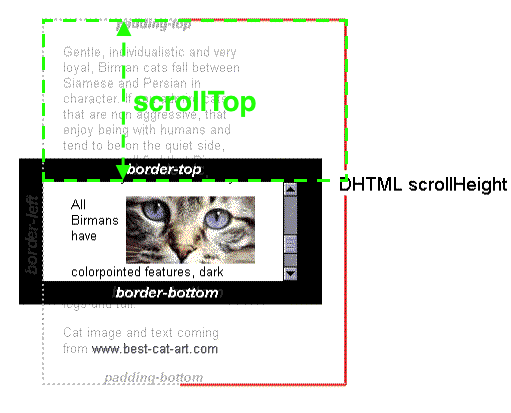

# 与scroll相关的方法

## window对象下: 

`window.scrollY (别名: window.pageYOffset)` 返回文档在垂直方向已滚动的像素值, 为了跨浏览器兼容，一般用别名。

`window.scrollX (别名: window.pageXOffset)` 返回文档/页面水平方向滚动的像素值, 为了跨浏览器兼容，一般用别名。

`window.scroll(x-coord, y-coord)  window.scrollTo(x-coord, y-coord)` 滚动窗口至文档中的特定位置。

## Element对象下:

> `clientHeight` 和 `offsetHeight`属性和元素的滚动、位置没有关系, 它代表元素的高度.

- `clientHeight`: 包括 `pending` 但不包括 `border`、水平滚动条、`margin`的元素高度.对于`inline`的元素这个属性一直是0, 单位 px, 只读.

  

当本元素的子元素比本元素高, 且 `overflow=scroll` 时, 本元素会`scroll`.

- `scrollHeight`: 代表包括当前不可见部分元素的高度, 可见部分是 `clientHeight`, `scrollHeight>=clientHeight`, 单位 px, 只读.

  

- `scrollTop`: 代表在有滚动条时, 滚动条向下滚动的距离, 即元素顶部被遮住部分的高度. 在没有滚动条时`scrollTop=0`. 单位 px , 读写(设置`scrollTop=0`时相当于滚动到顶部).

	

## HTMLElement对象下:

- `offsetHeight`: 包括`padding`、`border`、水平滚动条, 但不包括`margin`的元素高度. 对于`inline`元素这个属性一直是0, 单位 px, 只读.

	

- `offsetTop`: 当前元素顶部距离最近父元素顶部的距离, 与滚动条没有关系. 单位 px, 只读.

	

