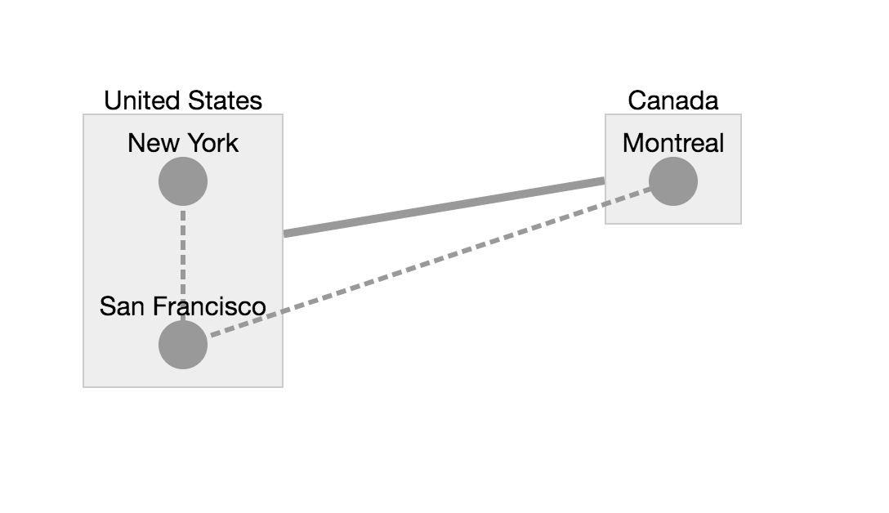

# Cytoscape.js 介绍

> cytoscape^3 官方文档: https://js.cytoscape.org/

用于可视化和分析的图论(网络)库.

为了使用Cytoscape.js，程序员必须考虑架构中的两个组件，即核心（即图形实例）和集合。 在Cytoscape.js中，核心是程序员进入库的主要入口点。 程序员可以从整体上运行布局，更改视口并在整个图形上执行其他操作。

| 缩写   | 意义                             |
| ------ | -------------------------------- |
| cy     | 核心                             |
| eles   | 一个或多个元素（节点和边）的集合 |
| ele    | 单个元素（节点或边）的集合       |
| nodes  | 一个或多个节点的集合             |
| node   | 单个节点的集合                   |
| edges  | 一个或多个边的集合               |
| edge   | 单个边的集合                     |
| layout | 布局                             |
| ani    | 动画                             |


### 位置

一个节点的位置是指其主体的中心点.

位置有一个很重要的区别: 位置可以是"模型位置" 或 "渲染位置"

- 模型位置(model position): 是指在模型中存储的位置. 无论缩放和平移, 元素的模型位置仍保持不变.
- 渲染位置(rendered position): 是指屏幕相对viewport位置. 例如，渲染位置{x：100，y：100}指定一个点，该点向右100像素，从视口的左上角向下100像素。 缩放1和平移（0，0）时，模型位置和渲染位置相同。

个人理解: 由于缩放和平移的存在, 所以设置的位置(模型位置)和实际的位置(渲染位置)是不同的, 例如, 设置位置x: 100 时如果 zoom: 2 (放大两倍), 则实际 x 的位置就是 x * zoom = 200

以下为转换方法:

```js
// Convert a rendered position to a model position
cy.toModelPosition = (pos) => {
    const pan = cy.pan();
    const zoom = cy.zoom();
    return {
        x: (pos.x - pan.x) / zoom,
        y: (pos.y - pan.y) / zoom,
    };
};
// Convert a model position to a rendered position
cy.toRenderedPosition = (pos) => {
    const pan = cy.pan();
    const zoom = cy.zoom();
    return {
        x: pos.x * zoom + pan.x,
        y: pos.y * zoom + pan.y,
    };
};
```


### 参数格式

```js
cytoscape({
  container: document.getElementById("cy"),

  elements: [
    // flat array of nodes and edges
    {
      // node n1
      group: "nodes", // 'nodes' for a node, 'edges' for an edge
      // NB the group field can be automatically inferred for you but specifying it
      // gives you nice debug messages if you mis-init elements

      data: {
        // element data (put json serialisable dev data here)
        id: "n1", // mandatory (string) id for each element, assigned automatically on undefined
        parent: "nparent", // indicates the compound node parent id; not defined => no parent
        // (`parent` can be effectively changed by `eles.move()`)
      },

      // scratchpad data (usually temp or nonserialisable data)
      scratch: {
        _foo: "bar", // app fields prefixed by underscore; extension fields unprefixed
      },

      position: {
        // the model position of the node (optional on init, mandatory after)
        x: 100,
        y: 100,
      },

      selected: false, // whether the element is selected (default false)

      selectable: true, // whether the selection state is mutable (default true)

      locked: false, // when locked a node's position is immutable (default false)

      grabbable: true, // whether the node can be grabbed and moved by the user

      pannable: false, // whether dragging the node causes panning instead of grabbing

      classes: ["foo", "bar"], // an array (or a space separated string) of class names that the element has

      // DO NOT USE THE `style` FIELD UNLESS ABSOLUTELY NECESSARY
      // USE THE STYLESHEET INSTEAD
      style: {
        // style property overrides
        "background-color": "red",
      },
    },

    {
      // node n2
      data: { id: "n2" },
      renderedPosition: { x: 200, y: 200 }, // can alternatively specify position in rendered on-screen pixels
    },

    {
      // node n3
      data: { id: "n3", parent: "nparent" },
      position: { x: 123, y: 234 },
    },

    {
      // node nparent
      data: { id: "nparent" },
    },

    {
      // edge e1
      data: {
        id: "e1",
        // inferred as an edge because `source` and `target` are specified:
        source: "n1", // the source node id (edge comes from this node)
        target: "n2", // the target node id (edge goes to this node)
        // (`source` and `target` can be effectively changed by `eles.move()`)
      },

      pannable: true, // whether dragging on the edge causes panning
    },
  ],

  layout: { name: "preset" },

  // so we can see the ids
  style: [{ selector: "node", style: { label: "data(id)" } }],
});

```

还可以用下面的格式:

```js
cytoscape({
  container: document.getElementById("cy"),

  elements: {
    nodes: [{ data: { id: "a" } }, { data: { id: "b" } }],
    edges: [{ data: { id: "ab", source: "a", target: "b" } }],
  },

  layout: { name: "grid", rows: 1 },

  // so we can see the ids
  style: [{ selector: "node", style: { label: "data(id)" } }],
});

```


### 复合节点

Cytoscape.js中引入了一个概念，复合节点是包含（父）或包含（子）在另一个节点内的节点。 父节点没有位置或大小，因为这些值是根据子节点的配置方式自动计算的。

示例：

```js
const options = {
  id: "cytoscape-compound",
  layout: { name: "preset" },
  style: { width: "100%", height: "450px" },
  stylesheet: [
    { selector: "node", style: { content: "data(label)" } },
    { selector: ".countries", style: { width: 5 } },
    { selector: ".cities", style: { "line-style": "dashed" } },
  ],
  elements: [
    // Parent Nodes
    { data: { id: "us", label: "United States" } },
    { data: { id: "can", label: "Canada" } },

    // Children Nodes
    {
      data: { id: "nyc", label: "New York", parent: "us" },
      position: { x: 100, y: 100 },
    },
    {
      data: { id: "sf", label: "San Francisco", parent: "us" },
      position: { x: 100, y: 200 },
    },
    {
      data: { id: "mtl", label: "Montreal", parent: "can" },
      position: { x: 400, y: 100 },
    },

    // Edges
    { data: { source: "can", target: "us" }, classes: "countries" },
    { data: { source: "nyc", target: "sf" }, classes: "cities" },
    { data: { source: "sf", target: "mtl" }, classes: "cities" },
  ],
};

```

效果如下:



